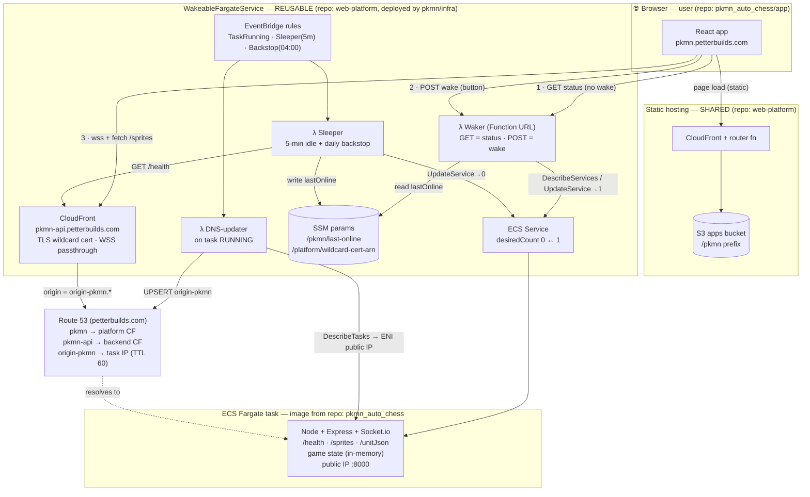
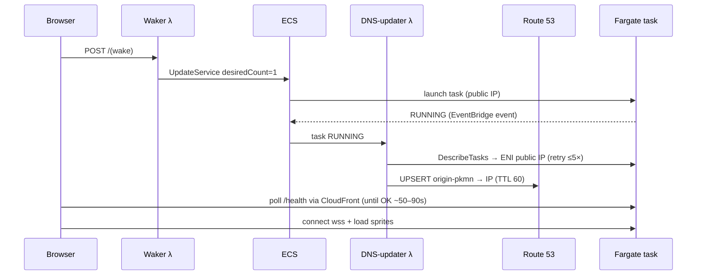
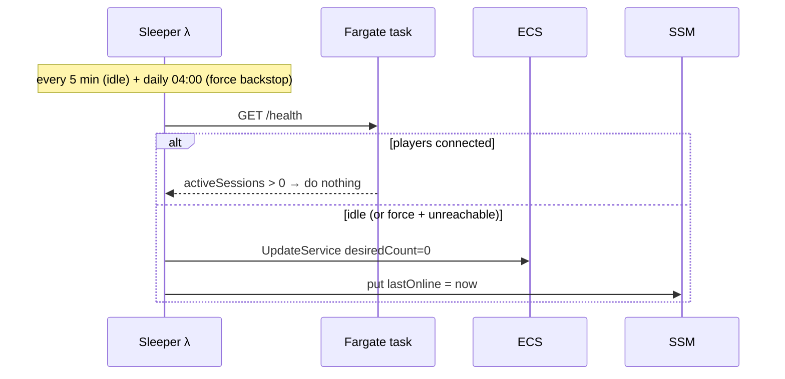

# Architecture — scale-to-zero hosting

How `pkmn.petterbuilds.com` (frontend) and `pkmn-api.petterbuilds.com` (scale-to-zero
Fargate backend) fit together, and **where each responsibility lives**.

## System diagram

## Who owns what / where the logic lives

| Component | Runs where | Responsibility | Repo |
|---|---|---|---|
| **React app** | Browser (served from S3/CloudFront) | GET status on load, "Wake" button → POST, connect `wss`, render asleep/waking/online + last-online | `pkmn_auto_chess/app` |
| **Static hosting** | CloudFront + S3 (always up) | Serve the frontend under `/pkmn` | `web-platform` (shared) |
| **Backend CloudFront** | Managed edge | TLS (wildcard cert) + WebSocket passthrough to the task | `web-platform` construct |
| **Waker λ** | Lambda (always available) | `GET` = report state (ECS counts) + `lastOnline` (SSM); `POST` = scale to 1 | `web-platform` construct |
| **DNS-updater λ** | Lambda (event-driven) | On task RUNNING: find task public IP (ENI), UPSERT `origin-pkmn` | `web-platform` construct |
| **Sleeper λ** | Lambda (scheduled) | Idle → scale to 0 + write `lastOnline`; daily backstop reclaims stuck tasks | `web-platform` construct |
| **ECS Service / Task** | Fargate (0↔1) | Run the game server; serve `/health`, `/sprites`, Socket.io; hold in-memory game state | image from `pkmn_auto_chess`, service from construct |
| **SSM params** | Managed | `last-online` (per app) · `wildcard-cert-arn` (platform) | construct / `web-platform` |
| **Route 53** | Managed | Public names + the runtime-updated `origin-pkmn` record | construct / `web-platform` |

**Key idea:** everything that must answer *while the task is down* lives in **Lambda / managed
services** (Waker, SSM, CloudFront, Route 53). The task itself only handles gameplay.

## Wake sequence

## Sleep sequence

